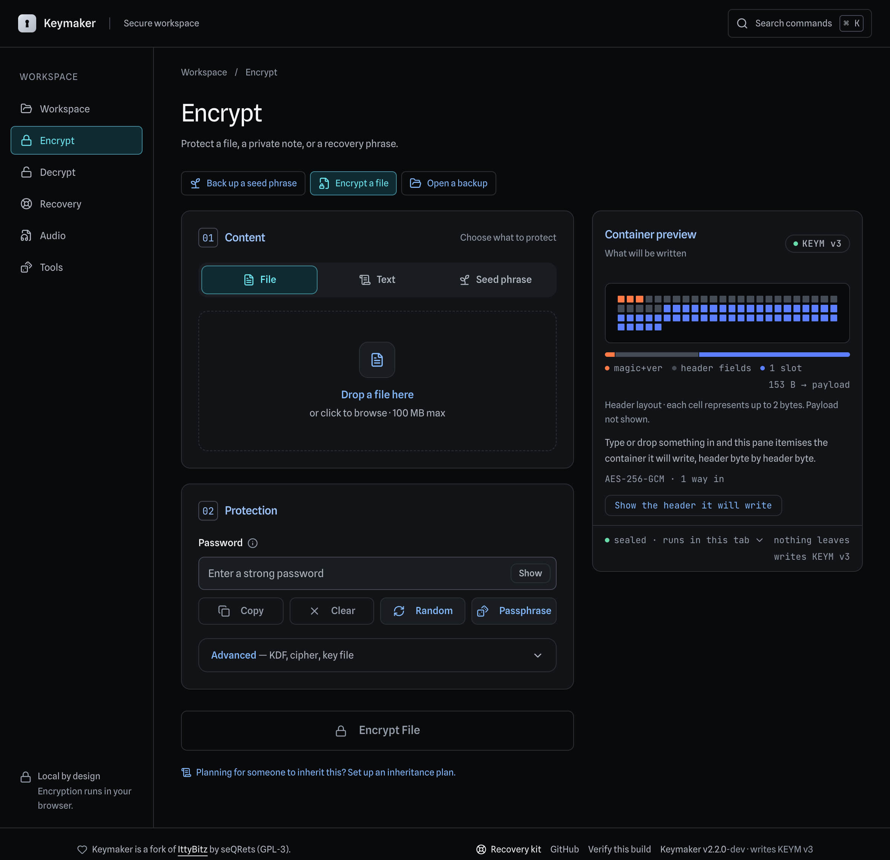
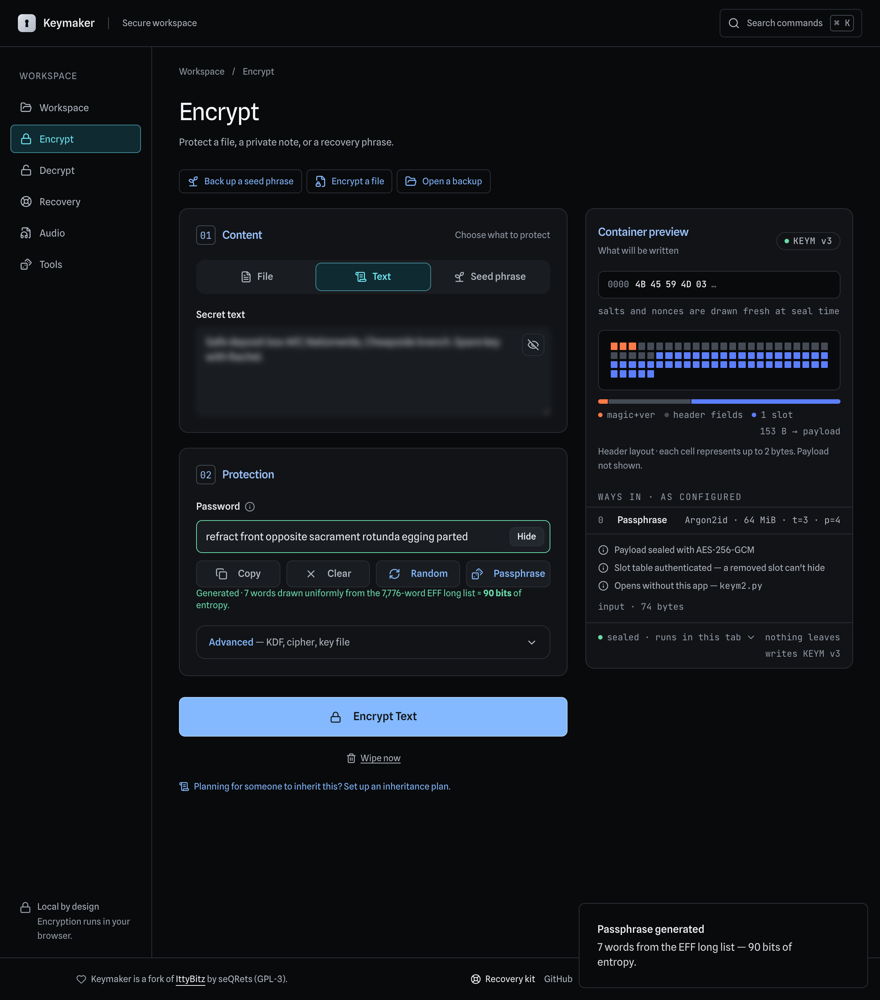
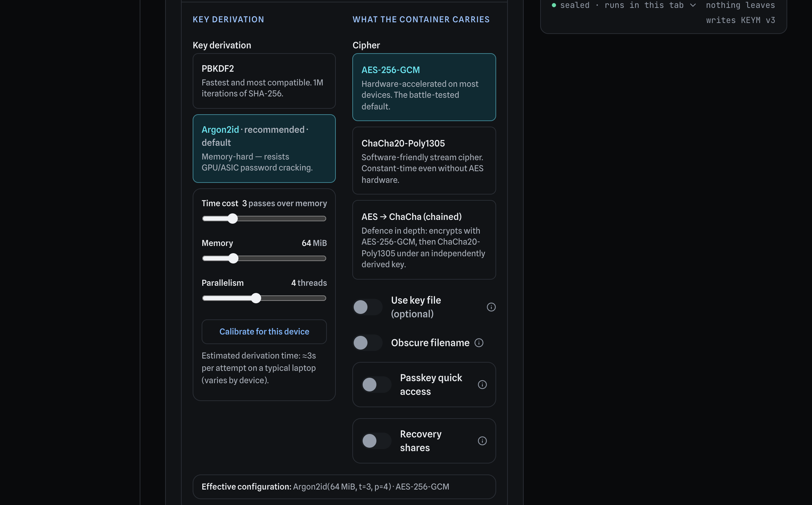
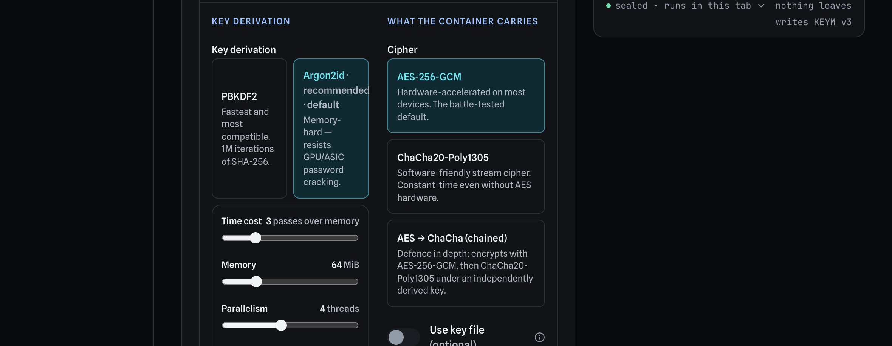
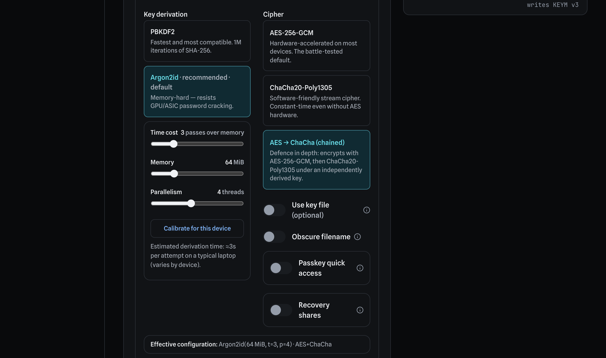
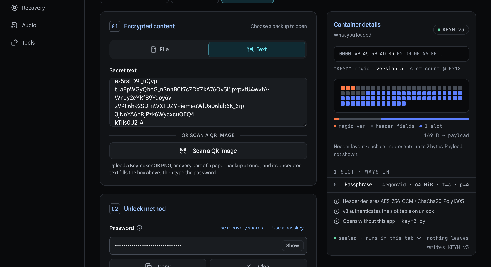
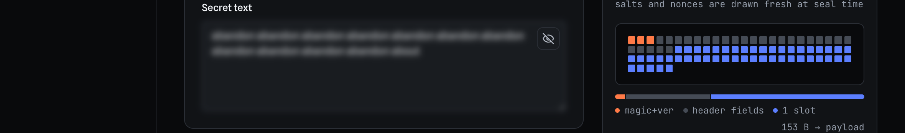
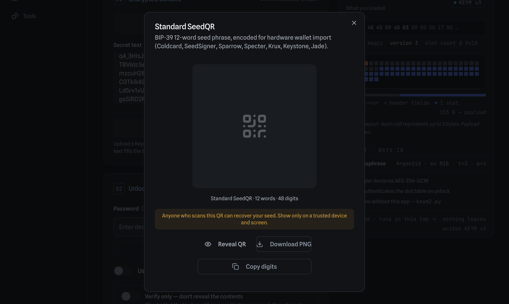
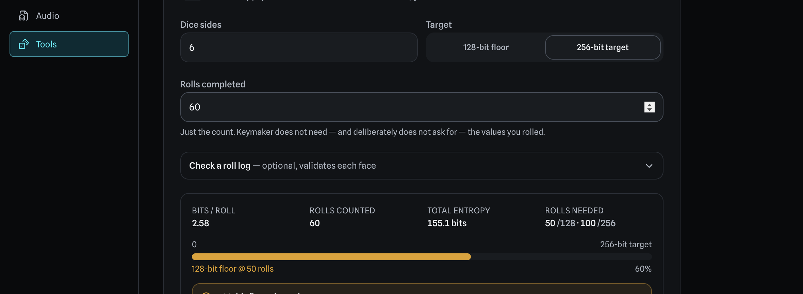

# Keymaker

[](https://github.com/404SecNotFound/Keymaker-v2/actions/workflows/ci.yml)
[](https://github.com/404SecNotFound/Keymaker-v2/actions/workflows/browser.yml)
[](https://github.com/404SecNotFound/Keymaker-v2/actions/workflows/conformance.yml)
[](docs/VERIFYING.md)
[](LICENSE)

### [→ Launch the app](https://404secnotfound.github.io/Keymaker-v2/)

<sub>Runs entirely in the browser. Nothing is uploaded, no account is needed, and it keeps
working offline once loaded. &nbsp;·&nbsp;
[Verify the build you are running](https://404secnotfound.github.io/Keymaker-v2/verify.html)</sub>

---

**Client-side encryption for files and text. Nothing ever leaves your browser.**

Keymaker encrypts confidential documents, personal notes, and seed phrases entirely
in the browser tab. There is no server, no account, and no upload — the production
build is a static export that talks to no server. The only requests it makes after
load are for its own files — the service worker precaches them so the app keeps
working offline. That is a property of the code rather than something the browser
enforces, and it is meant to be checked rather than believed: the build is
reproducible and the manifest is signed. [The security model](#security-model) is precise about what the Content
Security Policy does and does not add to that.

<p align="center">
  
</p>

---

## Contents

- [Why Keymaker?](#why-keymaker)
- [What's new in v2](#whats-new-in-v2)
- [The Advanced panel](#the-advanced-panel)
- [Self-describing containers](#self-describing-containers)
- [Seed-phrase awareness](#seed-phrase-awareness)
- [Dice entropy calculator](#dice-entropy-calculator)
- [Full feature list](#full-feature-list)
- [A backup, end to end](#a-backup-end-to-end)
- [Security model](#security-model)
- [Run it locally](#run-it-locally)
- [Documentation](#documentation)
- [Attribution and license](#attribution-and-license)

---

## Why Keymaker?

Four tools already do encryption well. Keymaker is not trying to replace them, and the
comparison is only worth reading if it says where they win — so it does.

| | Keymaker | [age](https://age-encryption.org/) | GPG | [Cryptomator](https://cryptomator.org/) | Typical browser tools |
|---|---|---|---|---|---|
| **Install needed** | none — open a URL | CLI binary | CLI + keyring | desktop/mobile app | none |
| **Trust anchor** | **whoever serves the page** | the binary you installed | the binary you installed | the app you installed | whoever serves the page |
| Format specified in writing | [yes](docs/FORMAT-V2-DESIGN.md) | yes | yes (RFC 4880) | yes | rarely |
| Independent implementation you can decrypt with | [`keym2.py`](reference/keym2.py), no browser | rage and others | many | Cyberduck, Mountain Duck | almost never |
| Signed releases | [Sigstore, keyless](docs/VERIFYING.md) | checksums + signed tags | distro-dependent | signed installers | almost never |
| [Reproducible](docs/VERIFYING.md) build, enforced in CI | yes | — | — | — | almost never |
| Hardware keys / smartcards | [passkeys](docs/FORMAT-V2-DESIGN.md) only | plugins | **yes** | no | no |
| Whole-folder, continuous use | no | no | no | **yes** | no |
| Works on a phone with nothing installed | **yes** | no | no | app | yes |
| Split a secret k-of-n | **yes** ([Shamir](docs/FORMAT-V2-DESIGN.md)) | no | no | no | no |
| Seed-phrase tooling (BIP-39, SeedQR, dice) | **yes** | no | no | no | no |

A dash means *not claimed here* rather than *absent* — these projects are Go, C and Java
respectively, and whether any given release is bit-reproducible is a question for their
own documentation, not one this table should answer on their behalf.

**"Passkeys only" is the honest cell.** Keymaker can unlock a backup with a passkey via
WebAuthn PRF, which is a real hardware path and a phishing-proof one. It is not smartcard
or PKCS#11 support, and it is **not extra strength**: the format requires a passkey slot
to sit beside another way in, so a container is exactly as strong as the weaker of the
two. What it buys is convenience and phishing resistance, which is worth having and is
not the same claim.

**Where the others are the better answer.** If you are comfortable at a terminal, `age`
is simpler than this and has no served-bundle problem at all — its trust anchor is a
binary you installed once and can pin. GPG is the only one here that talks to a YubiKey
or a smartcard, and the only one whose files anything will still open in twenty years.
Cryptomator solves a genuinely different problem: a vault you keep working inside, synced
to cloud storage, mounted like a drive. None of those jobs is Keymaker's.

**The honest weakness.** A web app has the weakest trust anchor of the four: code
delivered fresh on every visit by whoever controls the host. That is not a footnote — it
is the main reason to prefer a CLI. Keymaker's answer is not to deny it but to make it
checkable: every deployment ships a signed `SHA256SUMS`, the build is byte-for-byte
reproducible from a commit you can read — on a different machine, which is the part
that matters and the part CI checks — and the app tells you how to check the copy you
were served on its own [verify page](https://404secnotfound.github.io/Keymaker-v2/verify.html).
That narrows the gap. It does not close it, and [docs/VERIFYING.md](docs/VERIFYING.md)
says exactly what it leaves open.

**Where Keymaker is the better answer.** Someone needs to encrypt a seed phrase, a
recovery document or a photo of a passport, on a device whose toolchain they do not
control, without installing anything — and needs to open it again years later on a
machine that may not have this website, this app, or a browser. That is the case the
whole design is bent around: a specified container format, an independent Python
implementation shipped alongside the app, and a printed recovery procedure that involves
no software of ours at all.

---

## What's new in v2

v2 is a fork of [IttyBitz](https://github.com/seQRets/ittybitz) with the crypto design
from the Morpheus project ported in. IttyBitz offered exactly one configuration:
PBKDF2 at 1,000,000 iterations with AES-256-GCM, in a headerless container. v2 makes
the algorithm a choice, and writes that choice into the file.

| | IttyBitz (v1) | Keymaker (v2) |
|---|---|---|
| Key derivation | PBKDF2-SHA-256 only | PBKDF2 **or Argon2id** (memory-hard) |
| Cipher | AES-256-GCM only | AES-256-GCM, **ChaCha20-Poly1305**, or **both chained** |
| Container | headerless / `IBTZ` | self-describing **`KEYM`** with authenticated header |
| Tamper protection | ciphertext only | **entire header authenticated as AAD** |
| Unicode passwords | no normalization | **NFC-normalized** before derivation |
| Filenames | leaked in plaintext | optional **filename obscuring** |
| Seed phrases | BIP-39 validity hint | validity hint plus **Standard SeedQR export** |
| Entropy tooling | none | **dice entropy calculator** |
| Reading old files | n/a | **decrypts IBTZ v0 and v1 transparently** |

Everything IttyBitz could open, Keymaker still opens. That is enforced by a fixture
corpus of real ciphertexts from earlier releases, gated in CI.

---

## Two ways to get a password you can trust

<p align="center">
  
</p>

**Random** draws 32 characters from a 91-character set — 208 bits, and
completely unmemorable. **Passphrase** draws 7 words from the EFF Long
Wordlist — 90 bits, and you can copy it off a card without a transcription
error.

The second is not the weaker option. There is no server here and no account
recovery, so a password nobody can write down correctly is its own kind of
failure mode. 90 bits against a memory-hard KDF is not the number an attacker
goes after.

Both use rejection sampling, so neither inherits modulo bias, and the entropy
figures are exact rather than estimated. Keymaker states a figure **only** for
a password it generated itself: a typed one gets "minimum policy met" and a
plain admission that a string carries no evidence of how it was chosen.

The wordlist is the part that could go quietly wrong — a single duplicate entry
would make every printed bit-count an overstatement. So it is not transcribed
from memory. It is fetched from three independent redistributions that must
agree on the full ordered 7,776-word sequence, and CI re-derives EFF's own file
checksum from the shipped array offline on every run.

---

## The Advanced panel

Every new cryptographic choice lives behind one collapsible section, so the default
path stays a password field and a button.

<p align="center">
  
</p>

### Key derivation

Argon2id is the recommended default for new data. Time cost, memory, and parallelism
are all adjustable, with a live estimate of derivation cost per attempt — which is
also the cost imposed on anyone brute-forcing the password.

<p align="center">
  
</p>

PBKDF2 at 1,000,000 iterations remains available for maximum compatibility. It runs
entirely on WebCrypto and needs no WebAssembly.

### Cipher

<p align="center">
  
</p>

Chained mode encrypts with AES-256-GCM, then encrypts that ciphertext again with
ChaCha20-Poly1305 under an independent subkey derived via HKDF. This is algorithmic
defence in depth: recovering the plaintext means defeating both constructions, and
neither key is derivable from the other. It reduces reliance on any single cipher —
it is not a quantified guarantee, and it does nothing for a guessable password,
where the KDF is the bottleneck.

---

## Self-describing containers

A KEYM file carries its own parameters. Decryption needs no configuration — you supply
the password, and the container states which KDF, which cipher, and which parameters
were used. Those bytes are authenticated, so they cannot be rewritten to force a
downgrade.

<p align="center">
  
</p>

The readback line above is not a guess. It is the header the file itself declares,
after that header has been verified as additional authenticated data by every AEAD
layer. Flip one bit of it and decryption fails, rather than silently doing something
weaker.

See [`docs/FORMAT.md`](docs/FORMAT.md) for the byte-level specification and
[`docs/HOW-IT-WORKS.md`](docs/HOW-IT-WORKS.md) for the diagrams.

---

## Seed-phrase awareness

Keymaker recognizes BIP-39 seed phrases and signals validity through border color
alone — never with a label. A shoulder-surfer sees a green outline, not the words
"valid seed phrase", so the screen does not announce that it is holding a wallet.

<p align="center">
  
</p>

A phrase that is seed-shaped but fails its checksum turns red *before* you encrypt it,
catching a transcription error while it is still fixable, rather than after a bad
backup has been sealed and stored.

On decryption, a recovered seed can be exported as a **Standard SeedQR** for direct
import into Coldcard, SeedSigner, Sparrow, Specter, Krux, Keystone, or Jade.

<p align="center">
  
</p>

Note what this dialog does *not* do: the QR is not rendered until you press Reveal.
Plaintext QR codes are mount-gated and blurred, while ciphertext QR codes are shown
immediately — the interface treats "this pixel pattern is your seed" as a different
category of risk from "this pixel pattern is encrypted".

---

## Dice entropy calculator

Under the Tools tab. It answers one question: how many physical dice rolls do you need
for 128 or 256 bits of entropy?

<p align="center">
  
</p>

Bits per roll is log2(sides); total entropy is rolls times bits per roll. 128 bits is
treated as a floor and 256 bits as the target.

This tool **computes bits — it does not generate seeds**. It exists because hardware
RNGs have failed in the field, and physical dice derive their entropy from mechanics
you can watch rather than from silicon you have to trust. Generate the actual seed
from your recorded rolls on an air-gapped device, using dedicated, audited software.

---

## Full feature list

**Cryptography**

- Argon2id (RFC 9106, via hash-wasm) or PBKDF2-HMAC-SHA-256 at 1,000,000 iterations
- AES-256-GCM, ChaCha20-Poly1305 (RFC 8439), or the two chained with HKDF-derived
  independent subkeys
- Self-describing KEYM v2 container. There are two AADs, not one: the payload is
  authenticated against the 8-byte core header, and each slot's wrap against that
  header plus its own 48-byte prefix. `slot_count` is deliberately in neither, so a
  slot table stays editable by someone holding exactly one slot's secret
- NFC password normalization, so a password typed in a different Unicode form on
  macOS still decrypts elsewhere
- Optional key file, usable alongside a password; key files can be generated in-app
  from `crypto.getRandomValues`
- Rejection-sampled generators with no modulo bias: a 32-character random
  password, or a seven-word Diceware passphrase drawn from the EFF Long Wordlist
  (90 bits). An entropy figure is stated only for what Keymaker generated
  itself — a typed password gets "minimum policy met" and nothing more, because
  a string carries no evidence of how it was chosen
- The bundled wordlist is fetched from three independent redistributions that
  must agree, and checksummed against EFF's file in CI rather than trusted

**Files and transport**

- Files and text. Encrypted files use `.keym`; encrypted text is prefixed `keym2:` so
  blobs are self-identifying
- Optional filename obscuring, replacing the name with `keymaker-<random>.keym`
- QR export for encrypted text, and Standard SeedQR export for recovered seeds
- Transparent import of legacy IttyBitz `.ibitz` files and bare IBTZ blobs

**Privacy and operation**

- Static export with a `default-src 'none'` CSP and per-file inline-script hashes
- Installable PWA with full offline support; works air-gapped after first load.
  Every chunk the build emits is precached by the service worker at install, so
  offline does not depend on the browser's own HTTP cache still holding what you
  need days later
- Updates never install themselves over a live page. A new version waits and
  asks; you choose when to reload, because a page may be mid-derivation holding
  key material
- Secret input and decrypted output blurred by default
- Clipboard auto-clear after 60 seconds (best-effort)
- No accounts, no analytics, no fonts or assets from third-party origins

---

## A backup, end to end

[**docs/WALKTHROUGH.md**](docs/WALKTHROUGH.md) is the illustrated version: an
empty browser tab through to opening the file years later with Python and no
website. Every command in it is executed on each change and every screenshot is
generated from the production build, so it cannot quietly stop being true.

---

## Three ways to run this, and what each one costs

They are not the same trust model, and the difference deserves stating plainly
rather than being left in a footnote.

| | What you trust | What it costs |
|---|---|---|
| **Hosted** — [the live site](https://404secnotfound.github.io/Keymaker-v2/) | Whoever serves the bundle, **on every visit** | Nothing. Open a URL |
| **Downloaded and verified** — a [release](https://github.com/404SecNotFound/Keymaker-v2/releases), checked, then served locally | Whoever served it **once**, at a moment you chose and checked | One download, three commands, and re-doing it on upgrade |
| **Built from source** | The toolchain and the source you read | Node, an `npm ci`, and the willingness to read a diff |

**Hosted is the weakest, and it is the default**, because a tool nobody can open
protects nothing. But be clear what it means: the JavaScript is fetched fresh
every time, so a compromise of the host — or of anything between the host and
you — is a compromise of every future session, not only the one it happened in.
Verifying today says nothing about tomorrow's visit.

**Downloaded-and-verified is the real upgrade**, and it is why releases exist.
Fetch the tarball, check `SHA256SUMS` against its Sigstore signature, extract,
and serve the folder locally:

```bash
mkdir -p keymaker-local/Keymaker-v2
tar -xzf keymaker-<tag>.tar.gz -C keymaker-local/Keymaker-v2
cd keymaker-local && python3 -m http.server 8000
# then open http://localhost:8000/Keymaker-v2/
```

From then on the code is a file you control: nothing re-fetches it, and an
attacker needs your machine rather than the host.

**Do not open `index.html` directly from disk.** The release is built for the
path it is served from, so its scripts and stylesheets are referenced
absolutely — from a `file://` URL those resolve against the filesystem root and
every one of them 404s. The page still renders, because the HTML shell is
static, and it renders convincingly: heading, password box, Encrypt button, the
lot. None of it is wired up, because no JavaScript loaded. It cannot encrypt
anything, and it does not say so. The nested folder above exists precisely so
the `/Keymaker-v2/` prefix resolves; serving the extracted folder directly at
the server root fails the same way.
[docs/VERIFYING.md](docs/VERIFYING.md) has the commands, and the in-app
[verify page](https://404secnotfound.github.io/Keymaker-v2/verify.html) prints
them filled in for the build in front of you.

**Built-from-source removes the last party**, at the cost of trusting Node and
the dependency tree instead. The build is reproducible and CI enforces that, so
there is also a fourth posture — build it, compare your manifest to the
deployment's, and keep using the hosted one having *checked* it rather than
adopted it.

None of the three protects a compromised device. That is the next section.

---

## Security model

| Property | Strength of guarantee |
|---|---|
| Data never leaves the device | **Auditable, not structural.** There is no telemetry and no code that transmits anything; the build is reproducible and the manifest signed, so you can confirm that rather than trust it. The CSP raises the cost — `connect-src 'none'` blocks `fetch`, XHR, WebSocket, EventSource and `sendBeacon` — but it does not make transmission impossible: `img-src 'self'` alone lets a URL carry data off the page, and a `<meta>` policy does not reach Web Workers at all. [What the policy does and does not do](docs/HOW-IT-WORKS.md#what-the-csp-does-not-do). |
| Header cannot be downgraded | **Cryptographic, with one stated exception.** Every AEAD layer authenticates the header: the payload against the 8-byte core header, each slot's wrap against that plus its own 48-byte prefix. `slot_count` is deliberately in neither, so that a slot table stays editable by someone holding exactly one slot's secret — see [§5.3](docs/FORMAT-V2-DESIGN.md). Everything else is covered. |
| Old files keep opening | **Tested.** Fixture corpus from prior releases, gated in CI. |
| Wrong password indistinguishable from corruption | **By design.** Errors are generic, to avoid an oracle. |
| Key material is wiped | **Best-effort.** Buffers are zero-filled; the JavaScript GC may retain copies. |
| Recovered plaintext on disk | **Enforced for `--outfile`, and only there.** `reference/keym2.py` writes decrypted output at `0600` and narrows an existing file to match, so a recovery on a shared machine is not readable by other accounts. Redirecting stdout instead hands file creation to the shell, which uses your umask — usually world-readable. |
| Clipboard is cleared | **Best-effort, and only the current entry.** The browser may refuse the write. More importantly, clipboard *history* — Windows Win+V, a clipboard manager, phone keyboard history, cloud clipboard sync — keeps its own copy that no website can reach or even detect. If you copy a seed phrase on a machine with history enabled, treat it as still there. |

### What this does not protect against

Keymaker protects **data at rest**. Named plainly, because a vague disclaimer is
a way of not saying anything:

- **A compromised device.** Malware, a keylogger, or a hostile OS sees the
  plaintext and the password as you type them. No web app can fix this, and one
  that implied otherwise would be lying.
- **A malicious browser extension.** Extensions run inside the page's origin
  with permission to read the DOM. The CSP does not apply to them. An extension
  with access to this tab can read a secret before it is ever encrypted.
- **The clipboard.** Copying a container or a password puts it somewhere every
  other app on the machine can read, and on some platforms somewhere it syncs to
  other devices. Keymaker clears its own copies on a timer, but the browser can
  refuse, and anything that read it in the meantime already has it.
- **Someone looking at your screen.** Secret fields blur by default and reveal
  toggles exist for that reason, but a shoulder, a webcam and a screen-recorder
  all defeat it.
- **How long your plaintext is.** The container is not padded, and the final
  chunk is not padded either, so its length reveals the plaintext's length
  *exactly* — overhead is a constant, and one more byte in gives one more byte
  out. Not "to within a chunk": byte for byte. If the mere *size* of
  what you are protecting is sensitive — which document, which of two possible
  answers — that leaks regardless of the cipher. This is stated in
  [§8 of the format design](docs/FORMAT-V2-DESIGN.md) and a padding scheme is
  deliberately not in v2: it is its own design with its own trade-offs.
- **A weak password.** Argon2id makes guessing expensive; it cannot make a
  guessable password unguessable.
- **Forgetting the password.** There is no reset, no recovery email and nobody
  to call. This is the failure that actually happens.

For the highest-value secrets, run a
[verified download](#three-ways-to-run-this-and-what-each-one-costs) offline, on
a machine that never rejoins a network.

### Quantum computers

The short version: **a quantum computer does not give an attacker a way into a
Keymaker container that they do not already have.** The long version is worth
writing down, because "post-quantum" is now a marketing word and the honest
answer here is unusually simple.

**There is no public-key cryptography in a container.** Not weakened, not
hybrid — absent. The whole path is:

| Step | Primitive |
|---|---|
| Passphrase → key | Argon2id, or PBKDF2-HMAC-SHA-256 |
| Slot secret → key | HKDF-SHA-256 |
| Key wrapping, payload | AES-256-GCM, ChaCha20-Poly1305, or both chained |

No RSA, no elliptic curves, no Diffie-Hellman, no key exchange, no signature.
There is nothing in the file whose security rests on factoring or discrete
logarithms, which is the entire class of thing Shor's algorithm breaks. This is
enforced, not merely true today: `tests/browser/no-asymmetric-crypto.spec.ts`
fails the build if any of those primitives appears in the container path.

**Harvest-now-decrypt-later does not apply.** That attack works by recording a
public-key key-exchange today and breaking it once a quantum computer exists,
which retroactively reveals the session key. There is no key exchange here to
record. A container recorded today yields the same thing in 2050 that it yields
now: ciphertext under a key derived from a passphrase.

**Grover's algorithm is the one that does apply, and it is survivable.** It
gives at most a square-root speedup on brute-force search, which halves an
effective key length. AES-256 and ChaCha20-Poly1305 therefore retain roughly
128-bit strength — comfortably sufficient, and the reason NSA's CNSA 2.0 asks
for AES-256 rather than a new cipher. Nothing in the symmetric layer needs to
change.

Where Grover does bite is your passphrase, because that is the actual key: a
square-root speedup on guessing halves its effective entropy. That is not a new
weakness so much as the existing one, restated — a weak passphrase was always
the way in, and it stays the way in. It is why the app enforces a floor, ships
a [CSPRNG passphrase generator](#two-ways-to-get-a-password-you-can-trust) and a
[dice calculator](#dice-entropy-calculator), and why Argon2id is the default:
a memory-hard derivation raises the cost of each guess, quantum or not. Running
Argon2id in superposition over 64 MiB of state is far harder than the bare
square-root figure suggests, so treat the halving as a conservative bound.

**SHA-256, not SHA-384.** CNSA 2.0 specifies SHA-384, and this uses SHA-256 in
HKDF and PBKDF2. The relevant property here is pseudorandomness of a 256-bit
output, not collision resistance of the hash, so the binding constraint remains
the 256-bit key rather than the digest. Stated because someone arriving from
CNSA 2.0 will look for it.

**Quantum key distribution is irrelevant here, and that is not a dodge.** QKD
secures a key exchanged between two endpoints over a dedicated link. Keymaker
has no peer, no session and no channel — `connect-src 'none'`, a static export,
and a file you carry away yourself. There is nothing for QKD to secure.

**What would change this.** If Keymaker ever gains encrypt-to-a-public-key
recipients — an age-style "encrypt this for someone else's key" — that *would*
introduce an asymmetric layer, and it would need to be hybrid
(X25519 + ML-KEM) from the first release, because it is exactly the
harvest-now-decrypt-later shape that does not exist today. No such feature is
planned here; this is written down so the condition is on record rather than
rediscovered later.

One thing genuinely is quantum-vulnerable, and it is not the container:
**release signatures**. Sigstore signs `SHA256SUMS` with ECDSA. A quantum
computer could forge such a signature — but only going forward, against builds
not yet published; it cannot retroactively change what a signature you already
checked was signed over. Signature migration carries no harvest-now risk, which
is why the industry treats it as less urgent than key exchange, and why it is
noted here rather than acted on.

Report vulnerabilities via the contact in [SECURITY.md](SECURITY.md).

---

## Run it locally

Requires Node.js 22.22.2 or newer — that is the floor the dependency tree
imposes, not a preference, and it is the version CI runs.

```bash
npm ci                    # reproducible install from the lockfile
npm run dev               # development server on :9002
npm run build             # static export to out/, with CSP hash post-processing
npm run typecheck

npm run test:crypto       # frozen IBTZ core — the legacy decryption contract
npm run test:keymaker     # container suite — round-trips, tamper rejection, fixtures
npm run test:fuzz         # malformed containers against the parser
npm run test:browser      # the built export, in a real browser (needs build)
npm run test:conformance  # cross-test vs the independent Python reference
npm run test:recovery     # the documented recovery procedure, end to end

```

The browser suite runs against whichever layout it was built for. CI builds and
serves it the way `deploy.yml` does, under `/Keymaker-v2/`; locally it defaults
to the root so no environment is needed. To reproduce the deployed layout:

```bash
KEYMAKER_BASE_PATH=/Keymaker-v2 npm run build
KEYMAKER_BASE_PATH=/Keymaker-v2 npm run test:browser
```

`test:browser` needs `npx playwright install` once. `test:conformance` needs
`pip install -r reference/requirements.txt`.

Both must be set together: `output: 'export'` always writes to `out/`, so
whichever build ran last is what gets served, and a base-path run against a root
build fails loudly rather than testing the wrong thing. The root layout is what
a custom domain, an unpacked release archive or a file on disk gives you; the
base path is the subdirectory GitHub Pages actually serves from, a different set
of asset URLs, and until recently the one layout never loaded in a browser.

CI installs the oracle from `reference/conformance-requirements.txt` instead —
the same versions, resolved to their full transitive closure and pinned by
sha256, so the implementation the byte-equality suite checks against is the
audited code rather than whatever the index served that morning.
`requirements.txt` stays hash-free on purpose: it ships in the in-app recovery
kit, and hash-checking mode turns a wheel it has not heard of into a hard stop
for the one person who cannot debug it. Regenerate the pinned file with
`python3 scripts/pin-conformance-deps.py`; the conformance job runs
`--check` and fails if the two disagree.

`npm run build` produces a fully static `out/` directory. Serve it from any static
host, or open it from disk on a machine with no network connection.

---

## Recovering a file without Keymaker

A backup is only as durable as your ability to open it. If this app is gone,
unreachable, or you no longer trust the copy in front of you, your data is
still recoverable — the format is specified, and a second implementation of it
ships in this repository.

```bash
pip install cryptography argon2-cffi                  # or: -r reference/requirements.txt

python3 reference/keym2.py inspect --in backup.keym   # what is this file?
python3 reference/keym2.py decrypt --in backup.keym   # prompts for the password
```

No browser, no Node, no npm, no network. `inspect` reports the container's KDF,
cipher, and whether a key file is needed **without** asking for a password.
Any recent version of either library works — the container format does not
depend on them, and the conformance suite proves it by opening frozen fixtures
under whatever is installed. `reference/requirements.txt` records the versions
these scripts were actually run against, if you would rather pin.

**What it does so a recovery does not leak what it just recovered.** With
`--outfile`, the plaintext is written `0600` — owner only — and an existing
file at that path is narrowed to match rather than keeping the permissions it
already had. That covers `--outfile` and nothing else: redirect stdout instead
(`decrypt --in backup.keym > seed.txt`) and the *shell* creates the file, at
your umask, which on most systems is world-readable. Separately, passing a
secret as an argument — `--password`, `--share`, `--prf-output` — prints a
warning, because an argument sits in your shell history and was visible in the
process list to every other account on the machine while the KDF ran. Prefer
the interactive prompt, or `--shares-from` with a file only you can read.

**Two scripts, because there are two container versions.** The app writes
**KEYM v2** and `keym2.py` reads it. Backups made before that are **v1** and
need `keym.py`; neither script reads the other's format, and the one that
refuses is telling you which you have.
[docs/RECOVERY.md](docs/RECOVERY.md) is the printable procedure, and
[docs/WALKTHROUGH.md](docs/WALKTHROUGH.md) walks the whole path with pictures.

[`docs/RECOVERY.md`](docs/RECOVERY.md) is the full procedure, written to be
printed and stored alongside your backups. `npm run test:recovery` executes
those instructions on every push, so the page cannot quietly stop being true.

This is the point of specifying the format in [`docs/FORMAT.md`](docs/FORMAT.md)
and building a second implementation from that spec alone: your data depends on
a documented format, not on one program continuing to exist.

---

## Publishing

The **Launch the app** link at the top points at GitHub Pages. Every merge to
`main` publishes via [`.github/workflows/deploy.yml`](.github/workflows/deploy.yml);
the workflow can also be run by hand from the Actions tab to redeploy without a
new commit. Enabling it once, on a fresh clone or fork, is
**Settings → Pages → Source: GitHub Actions**.

A Pages project site is served from `/Keymaker-v2/` rather than the domain root, so
the deploy builds with `KEYMAKER_BASE_PATH=/Keymaker-v2`. Without it the exported
HTML would request its assets from the root and serve a blank page. The service
worker derives its own scope from where it is served, so it needs no configuration.

The browser job builds and serves that layout, and `tests/browser/base-path.spec.ts`
checks that no URL the export declares or requests escapes the prefix. It exists because the failure is quiet: a missing asset here
does not produce an error page, it produces a page that renders correctly and
cannot encrypt — and a `crypto-worker.js` that 404s falls back to running the
derivation on the main thread without reporting anything at all. The gate reads
the base path out of `deploy.yml`, so moving the deployment moves the test with
it instead of leaving it green and pointed at the old path.

To host somewhere else — a custom domain, Netlify, Vercel, an internal server —
build without `KEYMAKER_BASE_PATH` and upload `out/`. Nothing in the app assumes a
particular origin.

Because Keymaker does all its work in the browser, **whoever serves the bundle is
the trust anchor.** For high-value secrets, prefer a copy you built and verified
yourself, kept offline.

You no longer have to take that on trust, though. Every deployment publishes a
`SHA256SUMS` manifest of the exact bytes it served, signed with Sigstore by the
deploy workflow's own identity — no long-lived key to leak, and verification
asks "did *this repository's workflow* sign this", not "do you trust this key".
And the build is reproducible: rebuild the commit yourself and the manifest
matches. CI enforces that on two axes — twice on one runner, and again on
separate runners with a different checkout path and a different Node major —
because "the same command twice in the same container" is not the claim you
need. [What that does and does not cover](docs/VERIFYING.md#what-reproducibility-is-actually-checked-against)
is stated exactly; a different OS or CPU architecture is not enforced.

Those are two different claims and both matter. The signature says the site is
the artifact CI produced; the rebuild says that artifact matches the source you
can read. See [`docs/VERIFYING.md`](docs/VERIFYING.md) — the first check needs
nothing but `sha256sum`.

The Argon2id suite is deliberately slow. It runs real memory-hard derivations across
every KDF and cipher combination, and takes a few minutes.

---

## Documentation

| Document | Contents |
|---|---|
| [`docs/HOW-IT-WORKS.md`](docs/HOW-IT-WORKS.md) | Architecture and data flow, with diagrams |
| [`docs/FORMAT.md`](docs/FORMAT.md) | Normative KEYM v1 byte-level specification |
| [`docs/FORMAT-V2-DESIGN.md`](docs/FORMAT-V2-DESIGN.md) | Normative KEYM v2 specification — the format the app writes today |
| [`docs/ROADMAP.md`](docs/ROADMAP.md) | Phased plan: what ships next, and what was cut |
| [`docs/VERIFYING.md`](docs/VERIFYING.md) | Checking that the site you loaded is the code you read |
| [`docs/WALKTHROUGH.md`](docs/WALKTHROUGH.md) | A backup end to end, illustrated — first encryption through to recovery |
| [`docs/RECOVERY.md`](docs/RECOVERY.md) | Opening a backup without Keymaker — printable |
| [`reference/README.md`](reference/README.md) | Independent Python implementation, and why it exists |
| [`SECURITY.md`](SECURITY.md) | Threat model and vulnerability reporting |
| [`SECURITY-AUDIT.md`](SECURITY-AUDIT.md) | Current Keymaker v2 audit, findings and disposition |
| [`SECURITY-AUDIT-ITTYBITZ-2026-04.md`](SECURITY-AUDIT-ITTYBITZ-2026-04.md) | Historical IttyBitz audit — legacy core only |
| [`CHANGELOG.md`](CHANGELOG.md) | Release history |

---

## Attribution and license

Keymaker is a fork of [IttyBitz](https://github.com/seQRets/ittybitz) by seQRets,
licensed GPL-3. The cryptographic design — Argon2id, chained AEAD ciphers, the
self-describing authenticated container, and the dice entropy calculator — is ported
from the Morpheus project.

Licensed under the **GNU General Public License v3.0**. See [LICENSE](LICENSE).
