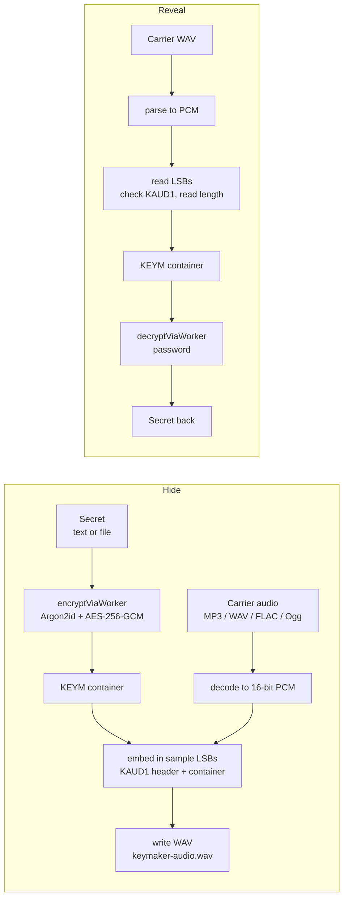

# KAUD1: the audio carrier layout

This note defines how Keymaker hides a KEYM container inside an audio file. It is
the audio analogue of a paper vault (§7.1): a **carrier**, not a cipher. The
bytes hidden in the audio are an ordinary KEYM v2/v3 container, so every
protection the container already has (Argon2id, AES-256-GCM, Shamir, the
independent Python decryptor) applies unchanged. Nothing here parses or weakens
that container.

This is concealment, not confidentiality. The confidentiality is the container's.
LSB steganography is **detectable** by steganalysis, so KAUD1 hides *that a
secret exists*, layered on real encryption; it does not make the secret
unrecoverable to someone who suspects it is there and has the password.

## The two flows

The crypto is entirely inside `encryptViaWorker` / `decryptViaWorker`; the boxes
either side of them are this carrier. A carrier with no `KAUD1` header never
reaches `decryptViaWorker`: it is reported as "nothing hidden" at the read step.

## Why the output is always lossless

The payload lives in the least-significant bit of each PCM sample. Lossy codecs
(MP3, AAC, Ogg Vorbis) discard exactly that bit under psychoacoustic
quantisation, so a container embedded and then MP3-encoded is destroyed (measured
bit-error near 0.5, i.e. total loss). Therefore:

- **Input** may be any format the browser can decode (MP3, WAV, FLAC, Ogg). A
  lossy input is decoded to PCM first; its compression artefacts are already
  baked into those samples, which is fine because they become the new lossless
  master.
- **Output** is always lossless. Phase 1 writes **16-bit PCM WAV**. FLAC output
  is a later addition and uses the same stream defined here.

There is deliberately no MP3 output. It cannot carry the payload.

## The sample stream

A carrier is 16-bit signed PCM, one or more channels, samples stored
interleaved exactly as a WAV `data` chunk stores them. The payload is written
into the LSB of consecutive samples in that stored order, starting at the first
sample. Phase 1 uses **one bit per sample** (`lsbDepth = 1`); the depth is
recorded in the header so a future higher-capacity mode stays readable by the
same extractor.

## Header

The embedded bit-stream is a fixed 10-byte header followed by the container
bytes. All multi-byte integers are big-endian.

| offset | size | field        | value                                            |
|-------:|-----:|--------------|--------------------------------------------------|
| 0      | 4    | magic        | `4B 41 55 44` (ASCII `KAUD`)                     |
| 4      | 1    | version      | `01`                                             |
| 5      | 1    | lsbDepth     | `01` in Phase 1                                  |
| 6      | 4    | payloadLen   | container length in bytes, `uint32` big-endian   |
| 10     | N    | payload      | the KEYM container, `payloadLen` bytes           |

Bits are written most-significant-first within each byte. The extractor reads
the 80 header bits, checks the magic and version, then reads `payloadLen` bytes.
A carrier whose first 80 LSBs are not the magic is reported as "no hidden data
found", never routed to the AEAD.

## Capacity

Usable bytes at depth 1 = `floor(numSamples / 8) - 10` (the header). Embedding
refuses when `container.length + 10` exceeds that. A 3-minute 44.1 kHz stereo
track holds roughly 2 MB, which is far more than a text secret or a small file
needs.

## Interop

TypeScript embeds and extracts this stream in `src/lib/audio-stego.ts`. Because
the payload is a plain container, `reference/keym2.py` can gain a WAV-extract
helper that reads this exact header and hands the container to the existing
decryptor, keeping the "opens without this app" promise. That helper is a
later addition and is not required for Phase 1.
