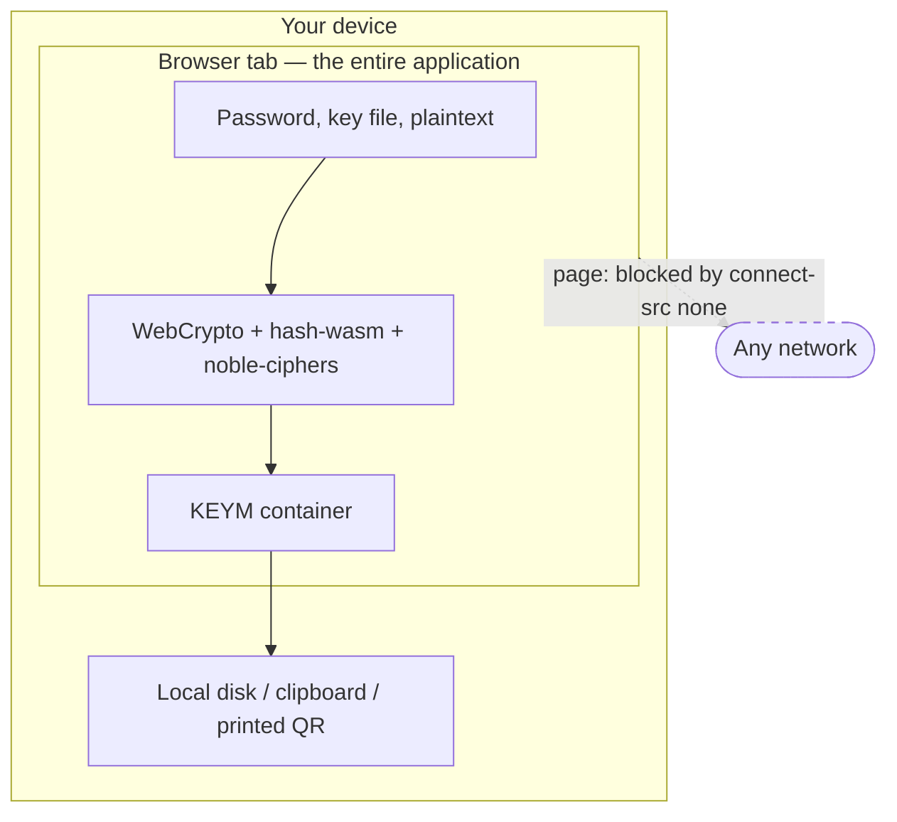
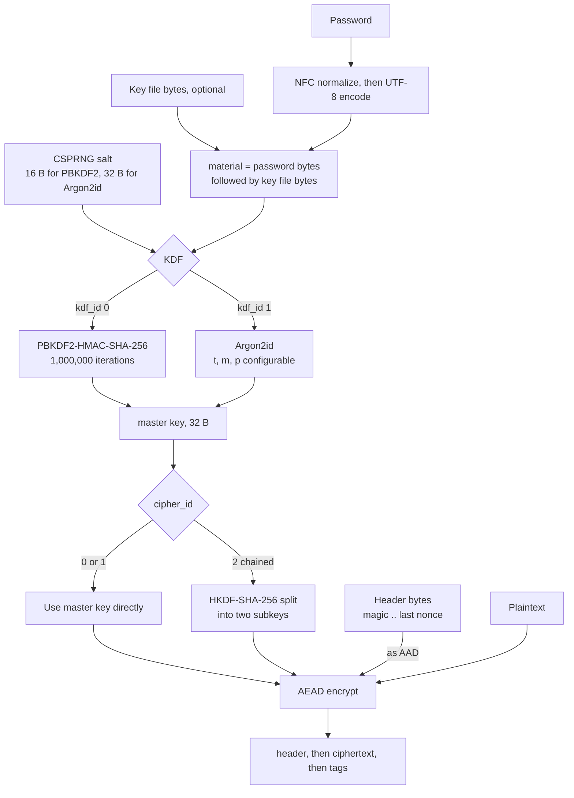
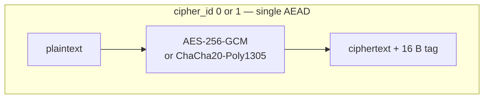
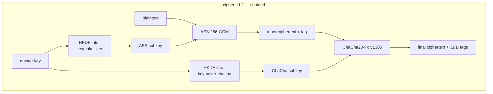
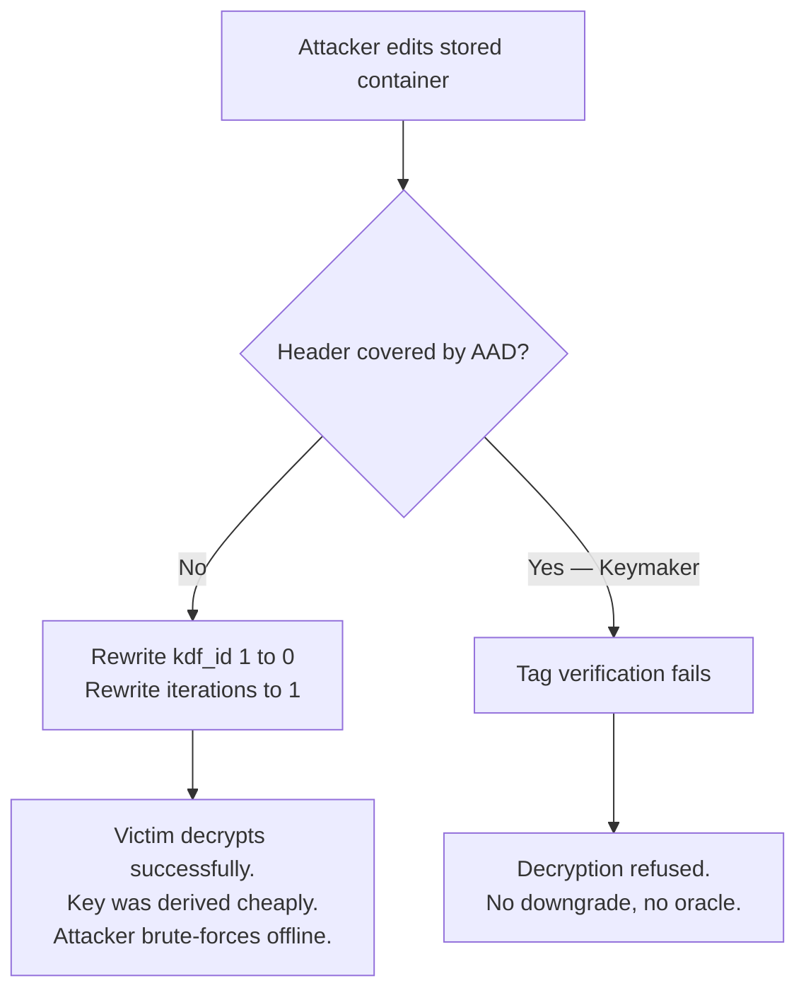
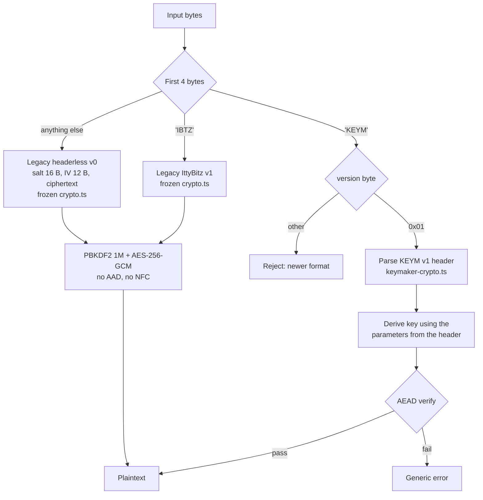
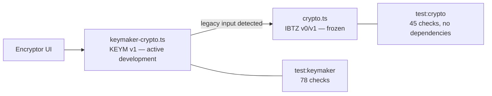
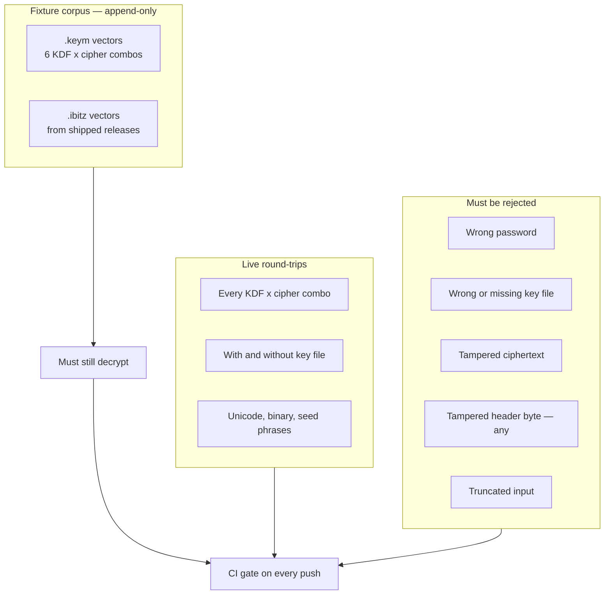

# How Keymaker Works

A walkthrough of the architecture, the cryptographic pipeline, and the container
format, with diagrams. For the normative byte-level specification, see
[`FORMAT.md`](FORMAT.md). This document explains the *why*; that one is the contract.

- [1. The trust boundary](#1-the-trust-boundary)
- [2. The encryption pipeline](#2-the-encryption-pipeline)
- [3. Key derivation](#3-key-derivation)
- [4. Cipher modes](#4-cipher-modes)
- [5. The container on disk](#5-the-container-on-disk)
- [6. Why the header is authenticated](#6-why-the-header-is-authenticated)
- [7. Decryption and format dispatch](#7-decryption-and-format-dispatch)
- [8. The frozen core](#8-the-frozen-core)
- [9. How this is tested](#9-how-this-is-tested)
- [10. Known limits](#10-known-limits)

---

## 1. The trust boundary

Everything inside the browser tab is the whole system. There is no server component
to compromise, no account to breach, and no request that could carry a secret off the
device.



Most of this is enforced by the browser rather than by our own good behaviour:

| Mechanism | Effect |
|---|---|
| `output: 'export'` | No server runtime exists. The build is static files. |
| `default-src 'none'` | Nothing loads unless explicitly allowed. |
| `connect-src 'none'` | In the page, `fetch`, XHR, EventSource and WebSocket are blocked outright — including to our own origin. Not inherited by workers; see below. |
| `worker-src 'self'` | Only same-origin worker scripts. A `blob:` or `data:` worker — the way injected script would try to escape the policy — will not start. |
| No third-party assets | No fonts, analytics, or CDN scripts to phone home. |
| Per-file script hashes | Inline scripts are pinned by SHA-256; injected ones will not run. |

The build fails closed. `scripts/apply-csp-hashes.mjs` refuses to emit a bundle whose
`script-src` still contains `'unsafe-inline'`, and equally refuses one that has lost
`'wasm-unsafe-eval'` — because without that token, Argon2id cannot instantiate its
WebAssembly module and would fail silently at runtime.

### The gap: a `<meta>`-tag CSP does not reach workers

The policy is delivered as a `<meta http-equiv>` tag, because a static host
cannot send response headers. That works for the document and **not** for a
dedicated worker: a worker fetched over HTTP takes its policy from its own
response headers, and a static host sends none. So the worker runs
unconstrained.

Measured against the production export, same-origin target, Chromium:

```
page   fetch: BLOCKED TypeError
worker fetch: ALLOWED 200
```

Keymaker runs its key derivation in a worker, so the directive that carries the
zero-egress claim does not cover the code handling your password. This page
previously said the property was structural. It is not, and this section exists
because that was worth correcting rather than leaving.

What is actually true:

- **The page cannot open a connection.** That part is the browser's doing and is
  asserted in the browser suite.
- **A worker could.** Nothing in the shipped code does, and you can check that —
  the build is reproducible and the manifest is signed, so the bytes you run are
  the bytes in the repository.
- **Reaching the worker requires shipping code in it.** `worker-src 'self'` stops
  injected script from starting its own, so the realistic path is a compromised
  dependency inside `crypto-worker.js` — a supply-chain problem, which is what
  reproducible builds and the signed manifest exist to make detectable.

Closing it properly needs a real `Content-Security-Policy` **header**, which
applies to workers too. That means a host that can send headers; GitHub Pages
cannot. Until then the honest description is "strong, with one gap", not
"structural".

---

## 2. The encryption pipeline

One pass, from typed password to finished container.



Two details in that diagram carry real weight:

**NFC normalization.** A password containing `é` can be encoded as one code point or
as `e` plus a combining accent. macOS and iOS often produce the second form. Without
normalization, the same typed password derives a different key on a different
platform, and the file simply will not open. Keymaker normalizes to NFC before
derivation. The legacy IttyBitz core does not — that gap is one of the reasons v2
exists.

**Key file concatenation.** The key file is appended *after* the password bytes,
matching the legacy convention so the two formats reason about key material the same
way. The key file is a second factor, not a replacement for a password.

---

## 3. Key derivation

The KDF is the only thing standing between a stolen container and its plaintext. Its
entire job is to make each password guess expensive.

| | PBKDF2-HMAC-SHA-256 | Argon2id |
|---|---|---|
| Cost model | CPU time only | CPU time **and** memory |
| Default | 1,000,000 iterations | t=3, m=64 MiB, p=4 |
| Salt | 16 B | 32 B |
| Output | 32 B | 32 B |
| Implementation | WebCrypto (native) | hash-wasm (WebAssembly) |
| GPU/ASIC resistance | Weak — parallelizes well | Strong — memory bandwidth bound |
| Needs `wasm-unsafe-eval` | No | **Yes** |

PBKDF2 is fast to attack in parallel: a GPU can run thousands of guesses at once
because each one needs almost no memory. Argon2id forces every guess to allocate and
randomly traverse its memory budget, so an attacker's parallelism is capped by memory
bandwidth rather than by core count. Raising the memory slider raises the attacker's
cost far more than it raises yours, because you pay it once and they pay it per guess.

PBKDF2 remains available because it needs no WebAssembly, which matters in locked-down
environments — and because the legacy format uses it.

---

## 4. Cipher modes





Chained mode is defense in depth against *cryptanalysis*, not against a weak password
— the KDF is still the bottleneck if the password is guessable. Its value is that a
break in one AEAD construction is not enough. The two keys come from independent HKDF
labels, so recovering one reveals nothing about the other.

Cost is 32 bytes of tags instead of 16, plus one extra pass over the data.

Decryption runs the chain in reverse: verify and decrypt the ChaCha layer, then the
AES layer. Each layer authenticates before it decrypts, so tampered data is rejected
at the outer layer without the inner key ever being applied.

---

## 5. The container on disk

Every KEYM file starts with a header that states exactly how it was made. Header
length depends on the KDF, because Argon2id needs more parameter bytes and a longer
salt.

**PBKDF2 header — 40 bytes, or 52 with a chained cipher**

```
 offset  0        4  5  6  7            11 12              28            40
         +--------+--+--+--+-------------+--+----------------+-------------+
         | "KEYM" |01|00|cc| iterations  |fl|   salt (16 B)  | nonce(s)    | ciphertext...
         +--------+--+--+--+-------------+--+----------------+-------------+
          magic    |  |  |   uint32 BE    |                    12 B, or
                   |  |  cipher_id        flags               24 B chained
                   |  kdf_id = 0x00
                   version = 0x01
```

**Argon2id header — 59 bytes, or 71 with a chained cipher**

```
 offset  0        4  5  6  7    9         13 14              47           59
         +--------+--+--+--+----+----------+--+--+------------+------------+
         | "KEYM" |01|01|cc| t  | memory   |p |fl| salt (32 B)| nonce(s)   | ciphertext...
         +--------+--+--+--+----+----------+--+--+------------+------------+
                            u16   u32 KiB  u8  flags           12 B, or
                                                               24 B chained
```

All multi-byte integers are big-endian. `cc` is the cipher id: `00` AES-256-GCM,
`01` ChaCha20-Poly1305, `02` chained. The flags byte currently carries one bit — a
hint that a key file was used — with the rest reserved and required to be zero.

Encrypted **text** is the same container, base64-encoded and prefixed `KEYM1:` so a
pasted blob identifies itself. Encrypted **files** get the `.keym` extension.

---

## 6. Why the header is authenticated

The header is not merely written to the file. Every byte of it, from the magic through
the final nonce, is fed to each AEAD layer as **additional authenticated data**.

```
    <------------- AAD: the entire header ------------->
    +--------+----+----+-----------+----+------+--------+-------------------+
    | "KEYM" | ver| kdf| kdf params|flag| salt | nonces |    ciphertext     |
    +--------+----+----+-----------+----+------+--------+-------------------+
                                                        <---- encrypted ---->
                                                        <-- authenticated -->
```

AAD is covered by the authentication tag but is not encrypted. That combination is
exactly what a self-describing format needs: the parameters must be readable before
you hold the key, and they must be unforgeable once you do.

Without this, the header would be attacker-controlled metadata. Consider what an
attacker who can modify a stored file could otherwise do:



That is the attack the AAD rule closes. A downgrade to PBKDF2-with-one-iteration would
be invisible to the user — the file would still open, and the password would still be
correct — while reducing an offline attack from infeasible to trivial. Because the
parameter bytes are authenticated, any such edit invalidates the tag and the file is
rejected outright.

The same protection covers the salt, the nonces, and the key-file flag.

---

## 7. Decryption and format dispatch

Keymaker reads three container generations. Detection is by magic bytes, and the
result is reported to the interface so it can tell you what it opened.



Note the single generic error path. Keymaker does not distinguish "wrong password"
from "corrupted file" in its messaging, because a system that does becomes an oracle:
an attacker probing a container could learn which guesses were structurally valid.

Legacy containers are handled by the frozen core with their original behavior intact —
no AAD, no NFC normalization — because changing any of that would break files people
already hold.

---

## 8. The frozen core

`src/lib/crypto.ts` is frozen. It implements the IttyBitz v0 and v1 formats and is not
modified, because every byte of its behavior is a promise to someone holding a file
encrypted years ago.

New work happens in `src/lib/keymaker-crypto.ts`. The two coexist:



The two test suites are deliberately separate in CI. `crypto-regression.yml` runs
without `npm ci` at all — the frozen core has zero dependencies, so the job that
guards your ability to decrypt old files never executes a single third-party install
script.

---

## 9. How this is tested



The fixture corpus is **append-only**. An existing fixture is never modified or
deleted, because each one is a standing assertion that a file encrypted by a shipped
version still opens today. Fixture credentials are published test values and must
never be used for real data.

The tamper tests are exhaustive over header positions: flipping *any* byte of the
settings block must produce a rejection. That is what turns the AAD rule from a design
intention into a verified property.

---

## 10. Known limits

Stated plainly, because a security tool that overstates itself is worse than one that
does less.

| Limit | Detail |
|---|---|
| Memory hygiene is best-effort | Buffers are zero-filled after use, but JavaScript's garbage collector may have already copied them. This cannot be fully solved in a browser. |
| Clipboard clearing is best-effort | The 60-second auto-clear depends on the page keeping permission; browsers may refuse. |
| No streaming | Files are processed whole, in memory, with a 100 MB cap. Large-file encryption has a peak-memory cost of several times the file size. |
| The served bundle is the trust anchor | Loading over the network means trusting the host that served it. For high-value secrets, use a copy you have verified and keep offline. |
| Argon2id needs WebAssembly | Environments that forbid WASM must fall back to PBKDF2. |
| A compromised device defeats everything | Keyloggers, malicious extensions, and screen capture are all outside what any in-browser tool can defend against. |

---

## Reference

| Primitive | Standard | Implementation |
|---|---|---|
| AES-256-GCM | NIST SP 800-38D | WebCrypto |
| ChaCha20-Poly1305 | RFC 8439 | @noble/ciphers |
| Argon2id | RFC 9106 | hash-wasm |
| PBKDF2-HMAC-SHA-256 | RFC 8018 | WebCrypto |
| HKDF-SHA-256 | RFC 5869 | WebCrypto |
| BIP-39 | BIP-0039 | in-repo wordlist and checksum |
| Standard SeedQR | SeedSigner specification | in-repo encoder |
