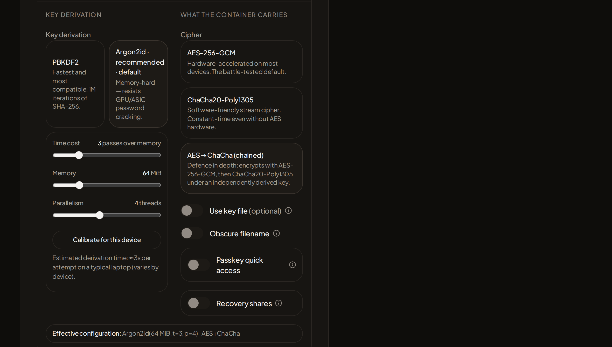
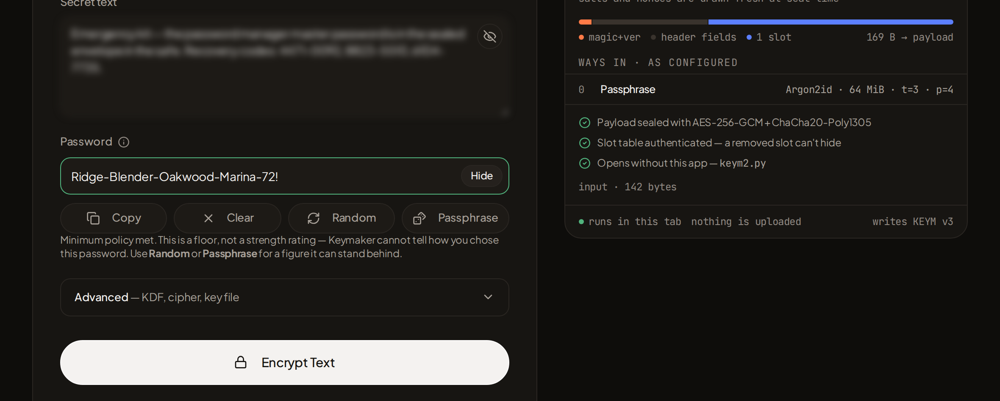
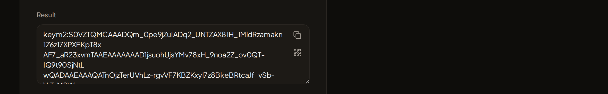

# A backup, end to end

From an empty browser tab to a file you can still open in ten years with no
website, no app, and no npm.

This is the long version, with pictures. Two shorter documents sit either side
of it: [RECOVERY.md](RECOVERY.md) is the one-page emergency card — print that
one and keep it with your backups — and [VERIFYING.md](VERIFYING.md) is how you
check that the copy of Keymaker in your browser is the one this repository
built.

Everything below is executed on every change. See [what keeps this page
true](#what-keeps-this-page-true) at the end, because a walkthrough nothing
runs is a walkthrough that stopped being correct some time ago and did not
mention it.

---

## The scenario

You are putting an emergency kit somewhere it will survive you losing your
laptop: where the password-manager master password is, and the recovery codes
for the account everything else hangs off.

It has to be readable by someone in a year, or by you in ten, on a machine that
may not have this website. That last requirement is the one that shapes every
choice below.

---

## Part 1 — Make the container

### Step 1: choose Text, and type the secret

Open [the app](https://404secnotfound.github.io/Keymaker-v2/) and switch from
**File** to **Text**. Type or paste what you want to protect.

The field blurs itself. That is not decoration — it is for the case where you
are doing this on a train, and it is why the walkthrough shot below shows a
smudge where the secret is.

### Step 2: decide how it will be protected

Open **Advanced**. Two choices matter, and both are written into the container
so that whoever opens it later does not have to remember what you picked.



- **Key derivation — Argon2id.** It is the default and it is the right default.
  PBKDF2 is faster and more compatible; Argon2id is *memory-hard*, which is what
  makes a GPU or an ASIC bad at guessing your password. The three sliders trade
  unlock time against cracking cost. **Calibrate for this device** measures your
  machine and picks the strongest settings that fit a time budget, which is
  better than guessing.
- **Cipher — AES → ChaCha (chained)** encrypts twice, under independently
  derived keys. Be clear-eyed about this: chaining two AEADs is defence in depth
  against one of them being broken, not a proven construction. Plain
  **AES-256-GCM** is the conservative choice and nobody should feel short-changed
  by it.

The **Effective configuration** line at the bottom is the whole decision in one
string. It is worth a glance, because it is what `inspect` will print back at
you years from now.

### Step 3: a password you will still have in a decade



Note what the app says about the password, and what it refuses to say:

> Minimum policy met. This is a floor, not a strength rating — Keymaker cannot
> tell how you chose this password.

That distinction is deliberate. A meter that scores a password it did not
generate is guessing, and a confident wrong number about how safe you are is
worse than no number. If you want a figure the app can stand behind, use
**Random** or **Passphrase** — those it generated, so it knows the entropy
exactly.

**The failure mode here is not cracking, it is forgetting.** There is no reset,
no recovery email, nobody to call. Write the password down and put it somewhere
physical, or use a passphrase you will genuinely still produce in ten years.

### Step 4: encrypt



What comes back starts with `keym2:` and is safe to paste anywhere text goes —
a note app, an email to yourself, a printed page. The **Download** button gives
you the same thing as a `.keym` file, which is what you want if it is going on a
USB stick.

Both forms hold identical bytes. Pick whichever survives your storage.

---

## Part 2 — Prove it opens, before you need it

This is the step people skip, and it is the one that decides whether any of the
rest mattered.

Go to **Decrypt**, paste the container back in, type the password, and turn on
**Verify only**.


Verify-only decrypts, authenticates, and throws the plaintext away without
rendering it, downloading it, or putting it on the clipboard. You learn that the
backup opens without putting the secret back on your screen.

Read the size. The panel nudges you about this for a reason:

> The size is worth a glance: the right password on the wrong backup still
> verifies.

Do this **while the original still exists**. A backup you have never opened is a
hypothesis.

### What to keep, and where

| Keep | Why |
|---|---|
| The container (`.keym` file or `keym2:` text) | The encrypted data itself |
| The password | Separately from the container. Two places, or it is one lost envelope away from gone |
| A copy of [`keym2.py`](../reference/keym2.py) | So Part 3 works with no network. The app ships one at `/recovery/keym2.py` |
| A printed [RECOVERY.md](RECOVERY.md) | The procedure, when there is no working computer to read a repo on |

The key file, if you used one, counts as a second password: lose it and the
container is gone, exactly as if you had forgotten the passphrase.

---

## Part 3 — Open it again, years later, with no website

Assume the site is gone and you have two things: `vault.keym` and the password.

### What you need

Python 3.10 or newer, and two libraries:

```bash
pip install cryptography argon2-cffi
```

If you are offline, both ship wheels you can download in advance and install
with `pip install --no-index --find-links <folder> cryptography argon2-cffi`.
Storing those wheels beside your backup is a reasonable precaution.

### Step 5: ask the container what it is

`inspect` needs no password and cannot damage the file:

```bash
python3 keym2.py inspect --in vault.keym
```

It prints the format, the KDF and its parameters, the cipher, and whether a key
file is required — the same string the app showed you as *Effective
configuration*. This is how you find out what you are dealing with before typing
anything secret.

If it refuses, you are holding a **v1** container from an older Keymaker. Use
`keym.py` instead; [RECOVERY.md](RECOVERY.md) covers telling them apart.

### Step 6: decrypt

```bash
python3 keym2.py decrypt --in vault.keym --out recovered.txt
```

You will be prompted for the password. It is not passed as an argument on
purpose — a command line ends up in your shell history and in the process list.

If your backup is the `keym2:` **text** form rather than a file, add `--armor`:

```bash
python3 keym2.py decrypt --in vault.txt --armor --out recovered.txt
```

That is the whole recovery path. One Python file, two mainstream libraries, no
browser, no Node, no npm, no network — and nothing from this project that you
have to trust, beyond a file you can read in an afternoon.

### Step 7 — if your backup is on paper

If you printed the paper vault instead of keeping a file, scan every symbol.
Each one decodes to a line starting `KMPART1:`. Put them all in one file, one
per line, and join them — order does not matter, each part says which it is:

```bash
python3 keym2.py join --in parts.txt --out vault.keym
```

You can go the other way too, to reprint a backup you still have:

```bash
python3 keym2.py split --in vault.keym --out parts.txt
```

Every part is needed. This is not a k-of-n share set — those are a different
thing, and `join` will tell you which parts are missing rather than handing you
a container that fails to open for reasons you cannot see.

### Step 8 — if your backup is a web page

If you saved a **self-extracting page**, you were left one `.html` file holding
the backup and a decryptor for it. Open it in any browser, type the password,
and it opens with no installation and no network. That is the whole point of it:
whoever finds the file does not have to find this page first.

It is an ordinary container underneath, so this script reads the file directly —
you do not have to pull the backup out of it by hand:

```bash
python3 keym2.py decrypt --in backup.html --out recovered-from-page.txt
```

Two things to know about that file. It uses **PBKDF2 rather than Argon2id**,
because browsers have had PBKDF2 built in for a decade while Argon2id needs a
WebAssembly module a page cannot count on carrying into 2040 — the trade is
"easier to open later" against "weaker if someone copies it today". And the
backup text is plainly visible inside the file, so even if the page's JavaScript
refuses to run, you can open it in a text editor, find the block beginning
`keym2:`, and use it like any other backup.

### If it does not work

The error will not tell you *which* input was wrong, and that is deliberate: an
error that distinguishes a bad password from a corrupt file is an oracle for
anyone who has stolen the container. [RECOVERY.md](RECOVERY.md) has the
troubleshooting list — the short version is check `inspect` first, check whether
a key file is `required`, and check for a stray newline if you pasted the text
form.

---

## What this walkthrough does not cover

- **[Recovery shares](FORMAT-V2-DESIGN.md).** You can split a container's key
  into *n* shares and require any *k* of them, so an heir with three envelopes
  can open it and any two of them cannot. That is the answer to "what if I am
  not around", and it is its own flow.
- **Key files**, which add a second factor that is a file rather than something
  you remember.
- **Seed phrases**, which get their own handling: a Seed Phrase mode that checks
  each word as you type it, BIP-39 detection in the plain text box, and SeedQR
  export for getting one onto paper without a camera or a network.
- **Whether the app you used was the real one.** Nothing above establishes that;
  [VERIFYING.md](VERIFYING.md) and the in-app
  [verify page](https://404secnotfound.github.io/Keymaker-v2/verify.html) do.

---

## What keeps this page true

The problem with a written walkthrough is the same as with a video: the UI
moves, and the document does not notice. Two things run on every change so this
one does.

**The pictures are generated, not taken.**
`scripts/capture-screenshots.mjs` drives a real browser through the exact steps
above against the production build. Regenerating them is one command, which is
the only reason it actually happens. Writing this page found the script had been
broken since the reveal toggle gained an `aria-label` — nothing ran it, so
nothing said so.

**The commands are executed, not transcribed.**
`reference/recovery_test.py` reads this file, extracts every `bash` block, and
runs the commands in it against a container produced by the *shipping*
encryptor — then checks the recovered bytes match what went in. If a flag is
renamed or a prompt changes, this page fails the build rather than misleading
somebody at the worst possible moment.

That is the same standard [RECOVERY.md](RECOVERY.md) is held to, and it exists
because that test has already caught three ways that document had quietly
stopped being true.
